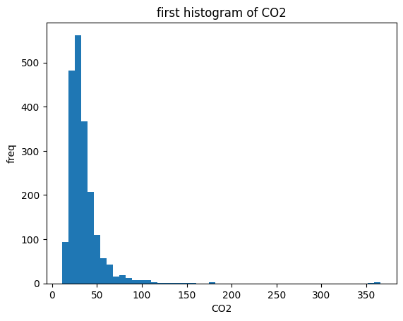

# Example for reliability based design for LCA in sandwich packages
Inventory data are assumed to exist within the folder named 'SandwichPackage'.
### Matrix-based LCA and sensitivity analysis
First, perform a matrix-based LCA and conduct a sensitivity analysis. Output the variables with high sensitivity values. Sensitivity analysis is conducted using the perturbation method algorithm proposed by Sakai and Yokoyama[1].Please refer to Reference [2] for detailed applications of the algorithm. As an example of LCA, we use the Sandwich Package case study presented in Reference [3].

[1][Shinsuke Sakai and Koji Yokoyama. Formulation of sensitivity analysis in life cycle assessment using a
perturbation method. Clean technologies and environmental policy, Vol. 4, No. 2, pp. 72–78, 2002.](https://link.springer.com/article/10.1007/s10098-002-0150-2)   
[2][Weizhe Lu,Satoshi Izumi, Shinsuke Sakai. Generalization of LCA Analysis Using the Matrix Method and Development of A General Purpose LCA System. Journal of Life Cycle Assessment, Japan,
Vol. 2, No. 3, pp. 266–272, 2006 (in Japanese).](https://www.jstage.jst.go.jp/article/lca/2/3/2_3_266/_article/-char/ja)   
[3][Reinout Heijungs. A generic method for the identification of options for cleaner products. Ecological Economics,
Vol. 10, No. 1, pp. 69–81, 1994.](https://www.sciencedirect.com/science/article/abs/pii/0921800994900388)   


```python
import PyMLCA as pm
dp=pm.DesignProcess()
# Define the folder where the inventory data exist.
path='./SandwichPackage'
dp.SetDfFromPath(path)
# Define the cutoff level for sensitivity values.
RankLimit=1.5
# Specify that the target environmental impact is 'CO2'.
variables=dp.CheckRankLimit(RankLimit,target='CO2')
print(variables)
# Save the dictionary-type data of input conditions in df
df=dp.GetDf()
#process         flow          value
#0     production of aluminum  electricity  1.980392
#1  production of electricity  electricity -2.000000
#2     production of aluminum  aluminum    -1.980392
```
It was identified that three flows have high sensitivity.
### Investigation of the statistical properties of environmental load
Conduct a Monte Carlo simulation with the number of samples specified by 'samples,' based on the statistical properties of the probabilistic variables. The tolerance level of environmental load is determined by referring to the histogram.

```python
samples=2000
X,W,variables=dp.rbld.Sampling(RankLimit,samples,target='CO2')
dp.Hist(W,target='CO2')
```
The following hisogram will be drawn.


### Creation of the response surface
After setting the conditions for the response surface calculation, perform the calculation of the response surface.

```python
dp.SetVal(RankLimit=RankLimit,samples=2000)
# Setting the tolerance level for environmental load.
dp.SetAllow(100.0)
# Save the mean values of the probabilistic variables for future calculations.
v_mean=dp.rbld.mean
# Creation of the response surface
r2_score,X,W,variables=dp.CalcSurface(target='CO2')
```
### Reliability analysis using obtained response surface
A reliability index for the set tolerance level is calculated.

```python
# Execution of reliability analysis
dp.ReliabilityAnal()
print('mean of variables=',v_mean)
print('Reliability index=',dp.rs.GetBeta())
#mean of variables= [-50.0, 1.0, 1.0]
#Reliability index= 2.379613155263891
```
Choose economic flow 'electricity' in Process 'production of aluminum' for the target entity. Make slight changes to the entity value and perform reliability analysis and PSF calculation.
```python
al_elec=-57
df['PROCESS']['production of aluminum'][0]=['I','electricity','kWh',al_elec,5]
dp.SetDf(df,read=False)
r2_score,X,W,variables=dp.CalcSurface(target='CO2')
dp.ReliabilityAnal()
print('Reliability index=',dp.rs.GetBeta())
print('PSF=',dp.rs.GetPSF())
#Reliability index= 1.7239254780014888
#PSF= [1.06860989 0.88929089 0.89348684]
```
Calculate the reliability index and PSF for other entity values as well.
```python
al_elec=-40
df['PROCESS']['production of aluminum'][0]=['I','electricity','kWh',al_elec,5]
dp.SetDf(df,read=False)
r2_score,X,W,variables=dp.CalcSurface(target='CO2')
dp.ReliabilityAnal()
print('Reliability index=',dp.rs.GetBeta())
print('PSF=',dp.rs.GetPSF())
#Reliability index= 3.3883930675077463
#PSF= [1.16758259 0.74455919 0.82226887]
```
By performing calculations for multiple entities, the relationship between the entity and the reliability index can be determined. Determine the entity value corresponding to the target reliability (e.g., Pf = 0.05, $\beta$= 1.64), and perform reliability analysis again for that value. Save the instance dp to a file (e.g., dp_CO2_0_05.pkl) at that time.

### Method for verifying whether the target reliability is satisfied
First, load the instance saved in the file.

```python
import pickle
with open("dp_CO2_0_05.pkl", "rb") as file:
    dp = pickle.load(file)
```
Obtain the partial safety factor corresponding to the target reliability.
```python
psf=dp.rbld.rs.GetPSF()
print(psf)
#[1.06120141 0.89131998 0.89707036]
```
Obtain the mean values of the probabilistic variables and verify that the evaluation value of the limit state function is approximately zero.
```python
v_mean=dp.rbld.mean
print(v_mean)
result = [a * b for a, b in zip(v_mean, psf)]
dp.rs.gcalc(result)
# -0.00019903149973288237
```
Check whether design1 satisfies the target reliability using the PSF.
```python
design1=[-50.0,1.0,1.0]
result = [a * b for a, b in zip(design1, psf)]
print('g value=',dp.rs.gcalc(result))
#g value= 40.02189033851164
```
Since the value of g is positive, it is confirmed that the target reliability is satisfied.

Check the other design values as well.
```python
design2=[-59.0,1.0,1.0]
result = [a * b for a, b in zip(design2, psf)]
print('g value=',dp.rs.gcalc(result))
# g value= -9.857328820929837
```
Since the value of g is negative, it is confirmed that the target reliability is not satisfied. Further check other design values as well.
```python
design3=[-57.0,0.9,1.4]
result = [a * b for a, b in zip(design3, psf)]
print('g value=',dp.rs.gcalc(result))
# g value= 75.68902981526918
```
Since the g value is positive and large enough, it is clear that the target reliability is sufficiently satisfied.

The same procedure can be applied to another environmental impact, such as Solid Waste.

